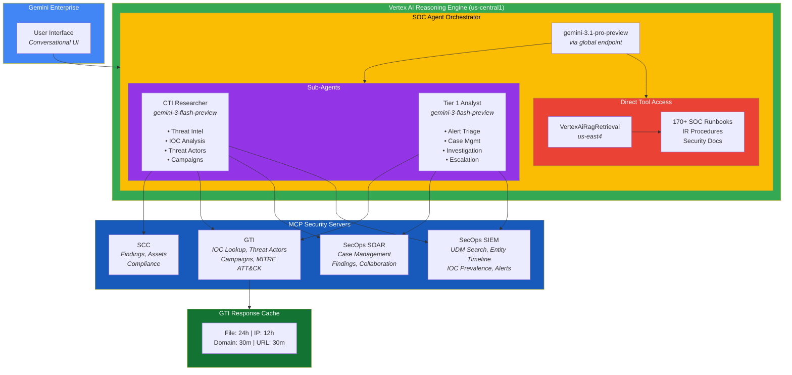

> [!WARNING]
> One user has reported ~$30/day expense in Spanner and a concern that it is due to the RAG Corpus from this project. I do not see this in my own projects but I am investigating further. In the meantime, please carefully monitor your expenses.

# GE SecOps Agent

Deploy security-focused AI agents to Gemini Enterprise with integrated access to SecOps SIEM, SOAR, Google Threat Intelligence, and Security Command Center through the Model Context Protocol (MCP).

Built with [Google ADK](https://google.github.io/adk-docs/) (Agent Development Kit) and deployed via Vertex AI Reasoning Engine.

## Table of Contents

- [Quick Start](#quick-start)
- [Architecture](#architecture)
- [Installation](#installation)
- [Configuration](#configuration)
- [Usage](#usage)
- [RAG Corpus Management](#rag-corpus-management)
- [Gemini Enterprise Integration](#gemini-enterprise-integration)
- [CLI Reference](#cli-reference)
- [Local Development](#local-development)
- [Troubleshooting](#troubleshooting)
- [FAQ](#faq)

## Quick Start

### Local Development (Recommended for Getting Started)

```bash
# Clone and setup
git clone --recurse-submodules https://github.com/googleSandy/ge-secops-agent.git
cd ge-secops-agent

# Configure environment
cp .env.example .env
# Edit .env with your Google Cloud credentials

# Install dependencies
python -m venv venv
source venv/bin/activate
pip install -r requirements.txt

# Run locally with ADK Web
cd soc_agent
GOOGLE_GENAI_USE_VERTEXAI=True \
GOOGLE_APPLICATION_CREDENTIALS=/path/to/service-account.json \
GOOGLE_CLOUD_PROJECT=your-project-id \
GOOGLE_CLOUD_LOCATION=us-central1 \
adk web
```

This opens an interactive web UI at `http://localhost:8000` where you can test all features instantly.

### Production Deployment

```bash
# 1. Verify setup and configure IAM (one-time)
python manage.py vertex verify
python manage.py iam setup

# 2. Deploy to Reasoning Engine
make agent-engine-deploy

# 3. Register with Gemini Enterprise
make agentspace-register
```

Run `make help` to see all available commands.

## Architecture



**Key Design Decisions:**
- **Orchestrator + Specialists**: Single user-facing agent delegates to persona-based specialists
- **RAG Isolation**: VertexAiRagRetrieval on orchestrator only (ADK constraint - cannot coexist with function tools)
- **MCP Integration**: Security tools accessed via Model Context Protocol servers
- **Response Caching**: GTI lookups cached with TTLs optimized by data volatility

## Installation

### Prerequisites

- Python 3.10+
- Google Cloud SDK configured
- GCP project with billing enabled

### Required APIs

```bash
gcloud services enable aiplatform.googleapis.com storage.googleapis.com \
  cloudbuild.googleapis.com compute.googleapis.com discoveryengine.googleapis.com
```

### Setup Steps

1. **Clone and configure:**
   ```bash
   git clone --recurse-submodules https://github.com/googleSandy/ge-secops-agent.git
   cd ge-secops-agent
   cp .env.example .env
   # Edit .env with your configuration
   ```

2. **Install dependencies:**
   ```bash
   pip install -r requirements.txt
   ```

3. **Verify setup and configure IAM:**
   ```bash
   python manage.py vertex verify
   python manage.py iam setup
   ```

4. **Deploy:**
   ```bash
   make agent-engine-deploy
   # Save AGENT_ENGINE_RESOURCE_NAME to .env
   ```

5. **Register with Gemini Enterprise:**
   ```bash
   make agentspace-register
   ```

## Configuration

See [.env.example](.env.example) for all environment variables. Key variables:

| Variable | Description |
|----------|-------------|
| `GCP_PROJECT_ID` | Google Cloud Project ID |
| `GCP_PROJECT_NUMBER` | Project number (numeric) |
| `GCP_LOCATION` | Deployment region (e.g., us-central1) |
| `GCP_STAGING_BUCKET` | GCS bucket for staging (gs://...) |
| `CHRONICLE_PROJECT_ID` | SecOps SIEM project |
| `CHRONICLE_CUSTOMER_ID` | SecOps customer ID |
| `SOAR_URL` | SOAR platform URL |
| `SOAR_API_KEY` | SOAR API key |
| `GTI_API_KEY` | Google Threat Intelligence API key |
| `RAG_CORPUS_ID` | RAG corpus resource name |

## Usage

### Example Queries

```
"What's the procedure for handling a ransomware incident?"
"Analyze the APT29 threat actor and their recent campaigns"
"Triage this phishing alert for user john.doe@company.com"
"Hunt for lateral movement using SMB in the last 7 days"
"Check IP 198.51.100.42 reputation and search for related activity"
```

### Common Commands

```bash
make agent-engine-deploy      # Deploy agent
make agent-engine-redeploy    # Redeploy existing agent
make agentspace-register      # Register with Gemini Enterprise
make agentspace-update        # Update registration
make warmup                   # Pre-warm MCP connections
make status                   # Check system status
```

## RAG Corpus Management

```bash
make rag-list                 # List all RAG corpora
make rag-create NAME="Security Runbooks"
make rag-info RAG_CORPUS_ID=projects/.../ragCorpora/...
make rag-delete RAG_CORPUS_ID=projects/.../ragCorpora/...
```

## Gemini Enterprise Integration

> [!IMPORTANT]
> When creating apps via API/CLI, include `--app-type APP_TYPE_INTRANET` and `--industry-vertical GENERIC` for visibility in the Gemini Enterprise UI.

**Create via Console (Recommended):**
1. Navigate to Vertex AI > Search & Conversation > Apps
2. Click **Create App** > Select **Agent** type
3. Copy App ID to `.env` as `AGENTSPACE_APP_ID`
4. Run `make agentspace-register`

## CLI Reference

| Makefile | Python CLI |
|----------|------------|
| `make agent-engine-list` | `python manage.py agent-engine list` |
| `make agentspace-register` | `python manage.py agentspace register` |
| `make rag-list` | `python manage.py rag list` |
| `make status` | `python manage.py workflow status` |

Run `python manage.py --help` for all commands.

## Local Development

### ADK Web (Recommended)

```bash
cd soc_agent
GOOGLE_GENAI_USE_VERTEXAI=True \
GOOGLE_APPLICATION_CREDENTIALS=/path/to/service-account.json \
GOOGLE_CLOUD_PROJECT=your-project-id \
GOOGLE_CLOUD_LOCATION=us-central1 \
adk web
```

Opens `http://localhost:8000` with:
- Real-time chat with agent
- Live tool call visualization
- Instant iteration without deployment

### Testing MCP Servers

```bash
cd mcp-security/server/secops-soar/secops_soar_mcp
uv run server.py
```

## Troubleshooting

| Issue | Solution |
|-------|----------|
| **403/401 Auth Error** | `gcloud auth application-default login` |
| **API not enabled** | `gcloud services enable aiplatform.googleapis.com` |
| **MCP module missing** | `git submodule update --init --recursive` |
| **Agent not in Gemini Enterprise** | `make agentspace-verify` then `make agentspace-link-agent` |
| **Agent not responding** | `gcloud logging tail "resource.type=aiplatform.googleapis.com/ReasoningEngine"` |

## FAQ

**Can I use this without SOAR?**
Yes. All security tool integrations are optional.

**What AI models are supported?**
Default is `gemini-3.1-pro-preview` for orchestrator, `gemini-3-flash-preview` for sub-agents. Configurable in agent.py.

**How do I update the agent?**
```bash
git pull && make agent-engine-redeploy && make agentspace-update
```

**What are the costs?**
Vertex AI charges per API call. Security products require separate licensing.

## Best Practices

- **Security**: Use Secret Manager for credentials, enable audit logging
- **Development**: Separate dev/staging/prod projects
- **Operations**: Set budget alerts, monitor quotas

## Resources

- [Google ADK Docs](https://google.github.io/adk-docs/) - Agent Development Kit
- [Vertex AI Docs](https://cloud.google.com/vertex-ai/docs) - Platform documentation
- [MCP Protocol](https://modelcontextprotocol.io/) - Model Context Protocol
- [SecOps Docs](https://cloud.google.com/chronicle/docs) - SIEM documentation
- [Security Command Center](https://cloud.google.com/security-command-center/docs)

## Support

- [GitHub Issues](https://github.com/googleSandy/ge-secops-agent/issues) - Report bugs or request features
- [Google Cloud Support](https://console.cloud.google.com/support) - Production issues
