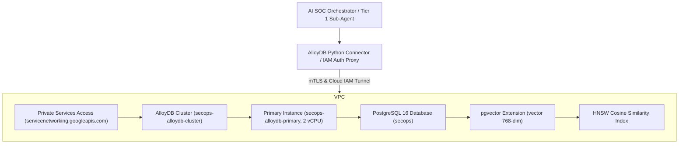

# Google Cloud AlloyDB Deployment and Grounding Guide

This guide provides step-by-step instructions for provisioning and configuring a fully managed **Google Cloud AlloyDB for PostgreSQL** cluster with `pgvector` support for the Agentic SOC multi-agent system.

---

## 1. Architecture Overview



AlloyDB provides:
- **Managed Storage**: Automatically autoscales up to 128TB with disaggregated compute and storage.
- **pgvector Integration**: Native vector storage and HNSW indexing for 768-dimensional Vertex AI embeddings.
- **IAM-Based Zero-VPN Access**: Secure database connectivity via the Google Cloud AlloyDB Python Connector or Auth Proxy without exposing database ports to the public internet.

---

## 2. Prerequisites & Authentication

Ensure you have Google Cloud CLI (`gcloud`) installed and authenticate with an account holding Project Owner or Editor permissions on the target project (`secops-demo-env`):

```bash
# Authenticate with Google Cloud
gcloud auth login

# Set active project and compute region
gcloud config set project secops-demo-env
gcloud config set compute/region us-central1
```

Verify the active authenticated account and quota project:

```bash
gcloud auth list
gcloud config list
```

---

## 3. Enable Required Google Cloud APIs

Enable the AlloyDB, Service Networking, and Compute Engine APIs on the project:

```bash
gcloud services enable \
    alloydb.googleapis.com \
    servicenetworking.googleapis.com \
    compute.googleapis.com \
    --project=secops-demo-env
```

---

## 4. Configure Private Services Access (VPC Peering)

AlloyDB instances communicate securely through your Google Cloud VPC network via Private Services Access:

```bash
# 1. Allocate a global internal IP range for VPC peering
gcloud compute addresses create alloydb-peering-range \
    --global \
    --purpose=VPC_PEERING \
    --prefix-length=16 \
    --network=default \
    --project=secops-demo-env

# 2. Connect VPC peering to servicenetworking.googleapis.com
gcloud services vpc-peerings connect \
    --service=servicenetworking.googleapis.com \
    --ranges=alloydb-peering-range \
    --network=default \
    --project=secops-demo-env
```

---

## 5. Provision the AlloyDB Cluster and Primary Instance

### Step 5.1: Create the AlloyDB Cluster

Create the regional AlloyDB cluster in `us-central1`:

```bash
# Set a strong database superuser password
export ALLOYDB_PASSWORD="<YOUR_SECURE_PASSWORD>"

gcloud alloydb clusters create secops-alloydb-cluster \
    --region=us-central1 \
    --network=default \
    --password="${ALLOYDB_PASSWORD}" \
    --project=secops-demo-env
```

### Step 5.2: Create the Primary Database Instance

Create a 2 vCPU primary instance with automated storage and automated daily backups:

```bash
gcloud alloydb instances create secops-alloydb-primary \
    --cluster=secops-alloydb-cluster \
    --region=us-central1 \
    --instance-type=PRIMARY \
    --cpu-count=2 \
    --project=secops-demo-env
```

To verify the cluster and instance status:

```bash
gcloud alloydb clusters describe secops-alloydb-cluster --region=us-central1 --project=secops-demo-env
gcloud alloydb instances list --cluster=secops-alloydb-cluster --region=us-central1 --project=secops-demo-env
```

The primary instance resource path will follow:
```
projects/secops-demo-env/locations/us-central1/clusters/secops-alloydb-cluster/instances/secops-alloydb-primary
```

---

## 6. Secure Database Connectivity

### Option A: AlloyDB Python Connector (Recommended for Agent & CLI)

The project includes `google-cloud-alloydb-connector` in `requirements.in`. The connector creates an encrypted, IAM-authenticated mTLS tunnel directly to the AlloyDB instance without requiring public IPs or SSH tunnels.

Configure `.env`:

```env
ALLOYDB_INSTANCE_URI=projects/secops-demo-env/locations/us-central1/clusters/secops-alloydb-cluster/instances/secops-alloydb-primary
ALLOYDB_DATABASE=secops
ALLOYDB_USER=postgres
ALLOYDB_PASSWORD=<YOUR_SECURE_PASSWORD>
ALLOYDB_USE_CONNECTOR=True
```

### Option B: AlloyDB Auth Proxy (For Local Inspection & GUI Tools)

For GUI tools like DBeaver, pgAdmin, or local scripts:

1. Download the AlloyDB Auth Proxy:
   ```bash
   curl -o alloydb-auth-proxy https://storage.googleapis.com/alloydb-auth-proxy/v1.9.0/alloydb-auth-proxy.darwin.arm64
   chmod +x alloydb-auth-proxy
   ```

2. Start the proxy listening on local port 5432:
   ```bash
   ./alloydb-auth-proxy "projects/secops-demo-env/locations/us-central1/clusters/secops-alloydb-cluster/instances/secops-alloydb-primary" --port 5432
   ```

3. Connect via standard PostgreSQL client on `localhost:5432`:
   ```env
   ALLOYDB_HOST=localhost
   ALLOYDB_PORT=5432
   ALLOYDB_DATABASE=secops
   ALLOYDB_USER=postgres
   ALLOYDB_PASSWORD=<YOUR_SECURE_PASSWORD>
   ```

---

## 7. Schema Initialization & Telemetry Ingestion

Once connected to the cloud instance, initialize the schema, ingest harvested investigations, and generate vector embeddings:

```bash
# 1. Initialize schema, tables, and pgvector extension
python manage.py alloydb init-schema

# 2. Ingest all 258 harvested detection reports, alerts, and entities
python manage.py alloydb ingest

# 3. Generate 768-dimensional Vertex AI text-embedding-004 embeddings
python manage.py alloydb embed

# 4. Verify table and embedding statistics
python manage.py alloydb info
```

---

## 8. Multi-Modal Similarity Queries on Cloud Grounding

Run multi-modal similarity searches and generate automated AI reports against the cloud database:

```bash
# Search by keyword or semantic query
python manage.py alloydb search "MSBuildShell"
python manage.py alloydb search "powershell download cradle" --semantic

# Find similar historical investigations with explainability
python manage.py alloydb find-similar 0a9a67ec-e42d-42e5-9c84-02305a04230a --profile threat-hunt --explain

# Generate complete Markdown report with Vertex AI Gemini 2.5 Flash synthesis
python manage.py alloydb report 0a9a67ec-e42d-42e5-9c84-02305a04230a --profile threat-hunt --ai
```

---

## 9. Teardown & Resource Management

To delete the primary instance and cluster when no longer needed:

```bash
# Delete primary instance
gcloud alloydb instances delete secops-alloydb-primary \
    --cluster=secops-alloydb-cluster \
    --region=us-central1 \
    --project=secops-demo-env \
    --quiet

# Delete cluster
gcloud alloydb clusters delete secops-alloydb-cluster \
    --region=us-central1 \
    --project=secops-demo-env \
    --quiet
```
