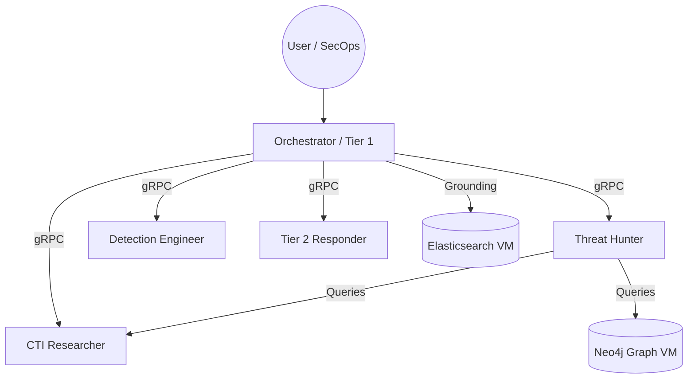

# Coordinated A2A Multi-Agent Architecture

The system is designed as a **Coordinated Agent-to-Agent (A2A) Network** consisting of five specialized agents, each packaged as a standalone Google Vertex AI ADK Reasoning Engine.

## Agent Profiles & Responsibilities

### 1. Orchestrator (`agent_soc_manager`)
- **Role:** Central coordination hub and primary user interface. Triages incoming alerts, coordinates complex investigations, and delegates tasks to remote specialists.
- **Model:** `gemini-3.1-pro-preview` (for reasoning-heavy coordination)
- **Sub-agents:** Hosts a local, in-process **Tier 1 SOC Analyst** sub-agent for initial alert telemetry triaging.
- **Grounding:** Directly queries the Elasticsearch index for runbooks and playbooks.

### 2. CTI Researcher (`agent_a2a_cti_researcher`)
- **Role:** Cyber Threat Intelligence specialist. Researches threat actors, profiles active campaigns, and dynamically analyzes malware families.
- **Model:** `gemini-2.5-flash`
- **Tools:** Direct integration with Google Threat Intelligence (VirusTotal API) and Vertex AI RAG.

### 3. Threat Hunter (`agent_a2a_threat_hunter`)
- **Role:** Proactive threat hunting specialist. Scans SIEM logs for active Indicators of Compromise (IOCs), compiles security timelines, and maps traversals.
- **Model:** `gemini-2.5-pro`
- **Tools:** Chronicle SIEM UDM Search, Threat Intel Caching, and Neo4j Graph queries.

### 4. Detection Engineer (`agent_a2a_detection_engineer`)
- **Role:** Detection lifecycle specialist. Translates discovered threat timelines and TTPs into SIEM detection rules and validates coverage against historical logs.
- **Model:** `gemini-2.5-pro`
- **Tools:** Chronicle SIEM Rules Engine.

### 5. Tier 2 Responder (`agent_a2a_tier2`)
- **Role:** Incident responder and containment specialist. Executes emergency containment playbooks, isolates hosts, and blocks domains.
- **Model:** `gemini-2.5-pro`
- **Tools:** Chronicle SOAR Playbooks, Endpoint Isolation API, and Manual Actions.

## Regional gRPC Client Routing

To avoid regional gRPC transport mismatches and minimize network latency, the Orchestrator routes communication to remote specialists using the **`RoutingEngineClient`** interface. This client dynamically resolves the specialists' Reasoning Engine resource names and establishes regional gRPC tunnels in their native GCP hosting regions (e.g. `us-east4` or `us-central1`).
