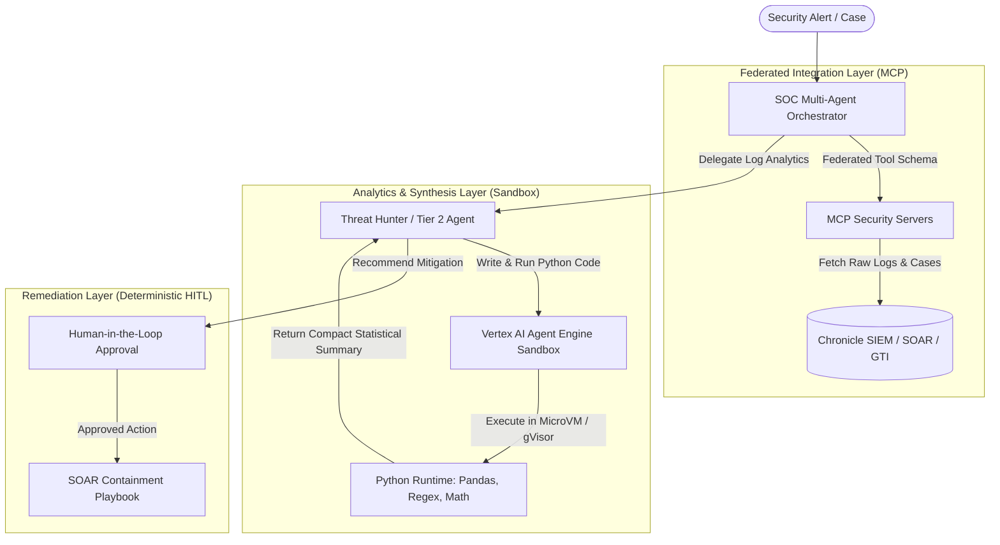

# Vertex AI Agent Engine Code Execution Architecture & Best Practices

## 1. Executive Summary

This document defines the architectural guidelines and design patterns for integrating **Code Execution Sandboxes** within the Agentic SOC ecosystem on **Vertex AI Agent Engine (Reasoning Engine)** using the **Agent Development Kit (ADK)**.

Modern agentic systems require a balance across three distinct operational primitives:
1. **Model Context Protocol (MCP)**: For standardized, federated connectivity to enterprise security systems (Chronicle SIEM, SOAR, Google Threat Intelligence, Security Command Center).
2. **Code Execution Sandboxes** (`AgentEngineSandboxCodeExecutor` / `VertexAiCodeExecutor`): For heavy data manipulation, log analytics, statistical calculation, and multi-step computational reasoning in isolated cloud microVMs.
3. **Function Calling & Deterministic Actions**: For stateful, high-impact security operations requiring Human-in-the-Loop (HITL) authorization.



---

## 2. Decision Matrix: Code Execution vs. MCP vs. Function Calling

| Evaluation Dimension | **Code Execution Sandbox** | **Model Context Protocol (MCP)** | **Function Calling** |
| :--- | :--- | :--- | :--- |
| **Primary Responsibility** | Large data crunching, algorithmic math, timeline sorting, and file analysis. | System-of-record integration and cross-agent tool federation. | Direct environment manipulation, client callbacks, and mutable actions. |
| **Context Window Consumption** | **Ultra-Low ($O(1)$ token overhead):** Raw logs (e.g. 5,000 UDM events) stay in sandbox storage; only computed results return to model. | **High to Medium ($O(N)$ tokens):** Tool payloads are serialized into model context unless aggressively truncated. | **Medium:** Tool arguments and returns occupy conversational turns. |
| **Roundtrips / Latency** | **Single-Turn Execution:** Model generates code, executes within sandbox, and produces answer in 1 cycle. | **Multi-Turn ($N$ hops):** Model requests tool $\rightarrow$ client invokes $\rightarrow$ model sees result $\rightarrow$ next tool. | **Multi-Turn:** Requires client callback loop for each execution. |
| **Statefulness** | **Stateful:** Loaded dataframes, variables, and modules persist across turns in the session. | **Stateless:** Each tool call is an independent request. | **Stateless:** Handled by application layer. |
| **Security Boundary** | Isolated Cloud Sandbox (MicroVM / gVisor) with default-deny egress and memory limits. | Standard process-level isolation (stdio) or HTTP/SSE network endpoints. | Host process memory. |
| **Representative SOC Tasks** | - Calculating beaconing periodicity and jitter.<br>- Shannon entropy calculation for DGA detection.<br>- Parsing nested process trees (`cmd.exe` $\rightarrow$ `powershell.exe`).<br>- Correlating massive auth logs. | - Querying Chronicle SIEM via `search_security_events`.<br>- Enriching IPs/domains via GTI (`get_ip_address_report`).<br>- Fetching SOAR case alerts. | - Requesting Human-in-the-Loop containment approval.<br>- Triggering endpoint network isolation. |

---

## 3. ADK Code Executor Implementations on Google Cloud

| Class Name | Runtime Environment | Isolation Level | Recommended Usage |
| :--- | :--- | :--- | :--- |
| **`AgentEngineSandboxCodeExecutor`** | Vertex AI Agent Engine (`sandboxEnvironments` sub-resource under `reasoningEngines`) | Managed cloud microVM (VPC-SC compliant) | **Primary Production Choice** for Agent Engine deployments. |
| **`VertexAiCodeExecutor`** | Vertex AI Code Interpreter Extension | Managed sandbox with pre-installed data science packages | Enterprise analytics and data visualization. |
| **`BuiltInCodeExecutor`** | Native Gemini API server-side execution | Model provider sandbox | Fast prototyping and stateless execution fallback. |
| **`ContainerCodeExecutor`** | Docker container (`python:3.11-slim`) | Container isolation | Hardened self-hosted environments. |
| **`UnsafeLocalCodeExecutor`** | Local host Python subprocess | None | Hermetic unit testing only. |

---

## 4. Threat Hunter Integration Pattern: "Code Over Tools"

In the Agentic SOC architecture, the Threat Hunter specialist analyzes large volumes of Chronicle UDM events. The hybrid "Code Over Tools" pattern operates as follows:

1. **Query & Capture**: Threat Hunter queries Chronicle SIEM via MCP (`search_security_events`).
2. **File Staging**: Rather than injecting 10,000 raw lines of JSON into the LLM prompt, telemetry is formatted as an input file (`udm_events.json` or `network_flows.csv`) mounted directly to the sandbox.
3. **Targeted Python Processing**: The agent writes a targeted Python script to extract statistics:
   ```python
   import json
   import pandas as pd
   import numpy as np

   # Load staged UDM events
   with open('udm_events.json') as f:
       events = json.load(f)

   df = pd.DataFrame([e['metadata'] for e in events if 'metadata' in e])
   # Calculate inter-arrival time standard deviation for beaconing detection
   ...
   ```
4. **Focused Synthesis**: The agent receives only the final computed statistics or anomalies and generates a structured hunting report.

---

## 5. Advanced SecOps Sandbox Primitives (Cloud Run Sandboxes Pattern)

Inspired by Google Cloud Run Sandboxes architecture (`04-secops-payload-detonator` and `01-hello-sandbox-101`), the Threat Hunter agent incorporates two critical security capabilities:

### A. Untrusted Dropper Detonation & Differential Filesystem Forensics
- **Function**: `detonate_and_capture_forensics(payload, payload_type="bash"|"python", timeout_sec=15, custom_workdir=None)`
- **Mechanism**:
  1. Snapshots baseline filesystem state in an isolated directory.
  2. Executes untrusted shell stagers, droppers, or unpacking scripts with strict timeouts and stripped environments.
  3. Performs pre/post directory diffing to extract dropped binaries, secondary payloads, or encrypted ransomware artifacts.
  4. Computes SHA-256 cryptographic hashes, size metrics, and text previews for all generated artifacts.
  5. Evaluates containment signals (blocked egress, C2 denial, GCP metadata server protection).

### B. Zero-Trust Sandbox Isolation & Credential Shielding Audit
- **Function**: `verify_sandbox_containment(metadata_ip="169.254.169.254", forbidden_env_keys=None)`
- **Mechanism**:
  1. **GCP Metadata Shielding**: Probes `169.254.169.254` instance endpoints to ensure compute metadata and workload identity tokens are unreachable from inside the sandbox.
  2. **Credential Sanitization**: Audits process environment variables against sensitive tokens (`CHRONICLE_SERVICE_ACCOUNT_PATH`, `GTI_API_KEY`, `SOAR_APP_KEY`, `HOST_SUPER_SECRET`).
  3. **Default-Deny Egress**: Verifies outbound socket attempts to non-routable external test destinations (RFC 5737 TEST-NET-2 `198.51.100.1`) fail with connection timeout or network refusal.
  4. Returns a hardened zero-trust security verdict.
