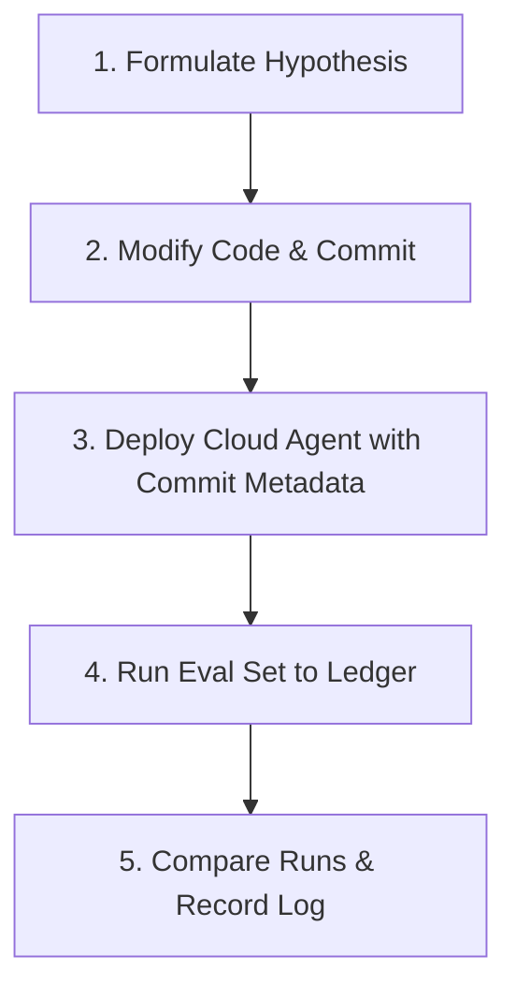

---
provenance:
  source_type: "generative_ai"
  source_tool: "Antigravity"
  timestamp: "2026-06-16T16:53:00Z"
---
# Evaluation Ledger & Regression Testing

This document outlines the architecture, design principles, and operational guide for the **Local Evaluation Ledger & Regression Engine** implemented in this repository.

> [!NOTE]
> This framework is designed to provide professional-grade LLM/Agent evaluation tracking, trajectory diffing, and regression isolation directly in the local developer workspace, without requiring external SaaS platform integrations.

---

## 1. Architectural Ancestry & Core Concepts

The Local Evaluation Ledger & Regression Engine is synthesized from industry-standard best practices across MLOps, LLM Observability, and Software Engineering CI/CD:

### A. MLOps Experiment Tracking (Inspired by MLflow & Weights & Biases)
Traditional machine learning relies on "Experiment Ledgers" to log every training run with its exact hyperparameters, model parameters, dataset versions, and the Git commit hash of the code. This project applies this discipline to Agentic systems by tying every evaluation run to:
* **Git Commit and Branch:** The precise state of the codebase.
* **Environment Metadata:** Active models, GCP projects, and region configurations.
* **Changelog Link:** Chronological mapping to git commits.

### B. Trajectory Diffing (Inspired by LangSmith & Arize Phoenix)
For multi-agent systems, evaluating the final response text is insufficient; we must evaluate *how* the agent arrived at its answer.
* **Tool Trajectories:** The sequence of tool calls and specialist delegations.
* **Trajectory Diffing:** When a score regresses, the comparison engine diffs the tool calls of the baseline and new runs to identify exactly where the agent's reasoning path deviated.

### C. Prompt GitOps & CI/CD Regression Isolation
In traditional software engineering, when a test suite regresses, developers run `git log` or `git bisect` between the last passing commit and the current commit to isolate the breaking code changes. This engine automates this process by executing:
```bash
git log [baseline_commit]..[new_commit] --oneline
```
and printing the exact list of code changes (the changelog) alongside the evaluation score delta.

---

## 2. Evaluation Ledger Directory Structure

All evaluation runs are recorded in structured JSON format under the `evalsets/eval_runs/` directory.

```text
evalsets/eval_runs/
├── run_cti_research_20260616T164245_5f98630.json
├── run_threat_hunting_20260616T164512_ae57e3e.json
└── ...
```

### JSON Run Schema Specification
Each ledger entry contains three primary blocks:
1. **`metadata`**: Contextual information about the test environment, Git branch/commit, and execution duration.
2. **`summary`**: Overall score, total cases, and warning/pass/fail status.
3. **`cases`**: Fine-grained, case-by-case results including user query, tool trajectory, and individual assertions passed or failed.

---

## 3. The Experimentation Log Registry

To treat prompt engineering and agent optimization as a rigorous science, the repository maintains an **Experimentation Log Registry** under `evalsets/experiments/`.

### A. Purpose & Value
* **Historical Auditability:** Keeps a permanent record of *why* specific prompts, tool constraints, or grounding structures were chosen, protecting the codebase from regression-inducing "re-tweaking".
* **Empirical Validation:** Every prompt/parameter change is tied directly to a hypothesis and its empirical scorecard results.
* **PR-Based Reviews:** Because experiment logs are structured Markdown files, changes can be reviewed and discussed by other engineers inside Pull Requests on GitHub before the code is merged.

### B. Standardized Schema (OKF Compliant)
Every experiment log must conform to Google's **Open Knowledge Format (OKF)** and use the standardized template:
👉 **[evalsets/experiments/template.md](file:///Users/dandye/Projects/agentic_soc_agentspace__worktrees/harvest_detection_reports/evalsets/experiments/template.md)**

It documents five key blocks:
1. **Metadata:** Target agent, evaluation set, baseline Git commit, and baseline score.
2. **Hypothesis & Goals:** The scientific rationale and targeted score delta.
3. **Implementation Plan:** Links to modified files and a clean Git diff code delta.
4. **Empirical Results & Scorecard:** The new Git commit, score delta (e.g., `▲ +31.0%`), newly passed assertions, and trajectory differences.
5. **Conclusion & Verdict:** The final decision (`MERGED`, `REJECTED`, or `ITERATING`) and key findings/next steps.

---

## 4. CLI Commands Reference

The evaluation engine is fully integrated into the master CLI (`manage.py`) under the `eval` subcommand namespace, and mapped to developer recipes in the `justfile`.

### Running an Evaluation and Logging to Ledger
To execute an evaluation set and automatically record the run in the ledger:
```bash
python manage.py eval run --file evalsets/cti_research.evalset.json
```
* **Developer Shortcut:** `just test-eval-cti` (or `just test-eval-all` to run all 7 suites).

### Comparing Runs & Regression Analysis
To compare the latest chronological run of an evaluation set against its previous run (or a designated baseline):
```bash
python manage.py eval compare cti_research
```

To compare two specific evaluation runs directly:
```bash
python manage.py eval compare cti_research --base evalsets/eval_runs/run_base.json --new evalsets/eval_runs/run_new.json
```

### Output Features:
* **Delta Calculations:** Displays global and per-case score deltas (e.g., `▲ +10.0%` or `▼ -5.0%`).
* **Tool Trajectory Diff:** Displays exactly which tools were added or removed from the agent's reasoning path.
* **Automated Changelog:** Extracts and displays the list of git commits between the two evaluation runs to correlate codebase modifications directly with score changes.

---

## 5. The Unified Git-MLOps Workflow

By coupling **Git history**, **live Vertex AI deployments**, and **evaluation ledger data**, you establish a rigorous, industry-grade MLOps loop:



1. **Formulate Hypothesis:** Determine the optimization target (e.g., "Enforcing Threat Hunter role sign-off will satisfy specialist attribution").
2. **Modify Code & Commit:** Implement the prompt/tool modification and commit the change to record its unique Git fingerprint (e.g., `git commit -m "..."`).
3. **Deploy Cloud Agent with Commit Metadata:** Push the update to Vertex AI in-place, and **stamp the Git commit directly onto the live cloud resource description** to create a perfect 1:1 mapping:
   ```bash
   just agent_module=agent_a2a_threat_hunter agent-engine-update description="Commit [hash]: Enforce Threat Hunter sign-off"
   ```
4. **Run Eval Set to Ledger:** Execute the evaluation suite (`just test-eval-hunt`) to record the run's tool trajectories and scores under the new Git commit.
5. **Compare Runs & Record Log:** Run the comparison engine to calculate score and trajectory deltas (`python manage.py eval compare threat_hunting`), and document the findings in a new experiment log (e.g., `evalsets/experiments/001_xxx.md`).
