# Playbook for Systematic Agent Experimentation


With a fully functioning **Local Evaluation Ledger & Regression Engine** and verified live database integrations, the Advanced Agentic SOC platform is primed for systematic engineering optimization.

This document serves as a **strategic playbook for designing and executing experiments.** It catalogs all the variable inputs (hyperparameters, architectures, grounding systems, and tools) that can be modified to drive improvements in evaluation scores, along with concrete methodologies for isolating variables.

---

## 1. Catalog of Experimental Variables (Inputs)

Optimizing a multi-agent network requires varying inputs across six core dimensions. Each variable acts as a lever to improve reasoning trajectories, tool call precision, and final response quality.

```mermaid
graph TD
    A["Experimental Inputs"] --> B["1. Agent Prompts & Persona"]
    A --> C["2. Grounding & Knowledge Bases"]
    A --> D["3. Tool Access & Schemas"]
    A --> E["4. Multi-Agent Architecture"]
    A --> F["5. Model Tiers & Settings"]
    A --> G["6. Context & Token Dynamics"]

    B --> B1["System Instructions"]
    B --> B2["Few-Shot Exemplars"]
    B --> B3["Formatting Rules"]

    C --> C1["Runbook Content"]
    C --> C2["RAG Vector vs. Lexical Search"]
    C --> C3["Neo4j Graph Schema"]

    D --> D1["Tool Registration Map"]
    D --> D2["Parameter Docstrings"]
    D --> D3["Payload Summarization"]

    E --> E1["Routing Topology"]
    E --> E2["Agent Split/Merge"]
    E --> E3["State Machine Workflows"]

    F --> F1["Pro vs. Flash Model Tiers"]
    F --> F2["Temperature & Top-P"]
    F --> F3["Safety Thresholds"]

    G --> G1["Token Budgets"]
    G --> G2["History Compression"]
    G --> G3["Noise Injection (Needle-in-a-Haystack)"]
```



### 1. Prompt Engineering & Identity
*   **System Instructions (Role & Directives):** The core persona definitions. You can vary directives (e.g., instructing the agent to be "paranoid about lateral movement", "strict about evidence validation", or "concise in technical summaries").
*   **Reasoning Constraints (Chain-of-Thought):** Explicit instructions on how the agent should structure its internal thoughts (e.g., requiring it to write a hypothesis *before* calling a tool, or to cross-reference SIEM events with threat intelligence).
*   **In-Context Learning (Few-Shot Exemplars):** Adding, removing, or refining few-shot examples inside system instructions. Providing examples of perfect Cypher queries or ideal YARA-L formats is highly effective for syntax-heavy tasks.
*   **Verification Gateways:** Instructions governing when the agent must stop and request human confirmation (via `request_human_confirmation`), or when it is authorized to proceed autonomously.

### 2. Grounding & Knowledge Base Systems
*   **Runbook/IRP Corpus Content:** Modifying, clarifying, or adding technical metadata to the Markdown runbooks in `external/ai-runbooks/` and `external/adk_runbooks/`.
*   **RAG Retrieval Algorithm:** Switching between semantic/vector search (Vertex AI RAG) and lexical/keyword search (direct GCE Elasticsearch VM search via `ELASTICSEARCH_GROUNDING_ENABLED`).
*   **RAG Search Parameters:**
    *   `RAG_SIMILARITY_TOP_K`: Tuning the number of retrieved documents (e.g., 3 vs. 5 vs. 10) to balance complete context against token bloat.
    *   `RAG_DISTANCE_THRESHOLD`: Adjusting the similarity cutoff (e.g., 0.4 vs. 0.6) to filter out irrelevant grounding noise.
*   **Graph Database (Neo4j) Model:**
    *   **Graph Schema:** Modifying node labels, relationship paths, and properties (e.g., adding parent process command lines, process execution hashes, or user account privileges) in `recalc_graph.py`.
    *   **Telemetry Horizon:** Increasing or decreasing the chronological window of raw logs compiled into `knowledge_graph.json` to vary the density of the threat graph.

### 3. Tool Access & Interface
*   **Agent Tool Registry Map:** Modifying which agents have access to which specific MCP servers and custom tools. (e.g., testing whether giving the CTI Researcher access to Chronicle UDM improves threat actor local correlation).
*   **Tool Schema & Parameter Docstrings:** Refining the JSON schemas and Python docstrings of tools. Making parameter names self-describing and clarifying instructions in the docstrings dramatically reduces LLM tool call rejections.
*   **Tool Payload Refactoring:** Modifying the raw return payloads of tools. (e.g., summarizing large raw JSON outputs into clean markdown tables, or truncating excessive payload fields to prevent token blowup).

### 4. Multi-Agent Architecture & Routing
*   **Routing Topology:** Toggling between **Hierarchical Routing** (the Orchestrator acts as a single-entry router delegating tasks to workers via gRPC) and **Collaborative Peer Routing** (agents directly invoke each other without returning to the Orchestrator).
*   **Agent Specialization (Split/Merge):** Splitting a broad agent into multiple micro-specialists (e.g., splitting the Tier 2 Incident Responder into a "Host Containment Specialist" and a "Disinfection Specialist") or merging them to reduce gRPC hops.
*   **Strict State Machine Workflows:** Implementing structured ADK workflows (using code-defined step transitions) to enforce a rigid sequence of actions, rather than relying on pure LLM autonomy.

### 5. Model Tiers & Settings
*   **Model Tier Selection:** Swapping the underlying Gemini models per agent:
    *   `gemini-3.1-pro-preview` / `gemini-2.5-pro`: Best for Orchestration, Cypher generation, and YARA-L logic.
    *   `gemini-2.5-flash` / `gemini-3.5-flash`: Best for high-throughput CTI enrichments, document retrieval, and basic triage.
*   **Hyperparameters:** Tuning `temperature` and `top-p` per agent. (e.g., setting temperature to `0.0` for syntax-critical agents like the Detection Engineer; setting temperature to `0.4` for threat hunters to encourage creative hypothesis generation).
*   **Safety Thresholds:** Adjusting safety filters to prevent false-positive blocks on queries containing malicious terms (like "ransomware payload" or "exploit code").

### 6. Context Window & Token Dynamics
*   **Token Budgets:** Restricting the maximum tokens allowed for conversation history or grounding context to evaluate agent performance under tight token constraints.
*   **History Compression:** Tuning the conversation memory compression algorithm (e.g., summarizing the oldest turns vs. completely dropping them).
*   **Noise Injection (Resilience Testing):** Intentionally injecting irrelevant grounding documents or massive, noisy SIEM telemetry logs into the context window to test the agent's "needle in a haystack" extraction capabilities.

---

## 2. Structured Experimentation Workflow

To ensure experimental rigor, all changes must be evaluated using a controlled scientific loop:

```text
1. Define Hypothesis ──> 2. Isolate Variable ──> 3. Run Eval Suite ──> 4. Compare Ledger & Diff Trajectories
```

### Step 1: Formulate a Hypothesis
State clearly what change you are making and what effect you expect it to have on the scorecard.
*   *Example:* "Registering the Neo4j query tool to the Threat Hunter and updating its system instructions will allow it to successfully traverse the lateral movement path in Case 2, increasing the score from 50.0% to >75.0%."

### Step 2: Isolate the Variable
Make **one change at a time** on a clean feature branch. Do not mix prompt edits, tool updates, and model swaps in a single run, as this makes it impossible to isolate which change drove the score delta.

### Step 3: Run the Evaluation
Execute the targeted evaluation suite and let the ledger record the run.
```bash
just test-eval-hunt
```

### Step 4: Compare & Diff Trajectories
Use the comparison engine to diff the new run against your baseline:
```bash
python manage.py eval compare threat_hunting
```
Analyze:
1.  **Score Delta:** Did the score improve, regress, or remain flat?
2.  **Trajectory Diff:** Did the agent take the expected reasoning path (e.g., calling `query_neo4j_graph` instead of falling back to multiple slow `search_security_events`)?
3.  **Changelog Correlation:** The CLI will automatically print the git commits associated with this run, creating a permanent, auditable record of prompt engineering changes.

---

## 3. High-Priority Experiment Ideas

Here are three high-priority experiment designs ready for execution:

### Experiment A: Prompt Few-Shotting for Cypher Generation
*   **Target Agent:** Threat Hunter
*   **Hypothesis:** Adding three few-shot examples of complex Cypher queries (e.g., tracing a user login from workstation to DC, or connecting process hashes to alert nodes) to the system prompt will eliminate syntax rejections and raise the Threat Hunting Case 2 score to 100%.
*   **Variable to Modify:** Threat Hunter system instructions in `agent_a2a_threat_hunter/agent.py`.

### Experiment B: Lexical (Elasticsearch) vs. Semantic (RAG) Grounding
*   **Target Agent:** Orchestrator / Tier 1 Triage
*   **Hypothesis:** Lexical search via Elasticsearch is more effective than semantic vector search for matching exact technique IDs (e.g., `T1059.001`) and indicator names in runbooks, leading to higher scores on basic operations.
*   **Variable to Modify:** Toggle `ELASTICSEARCH_GROUNDING_ENABLED` in `.env`.

### Experiment C: Model Tier Optimization (Pro vs. Flash)
*   **Target Agent:** CTI Researcher
*   **Hypothesis:** Swapping the CTI Researcher from `gemini-2.5-flash` to `gemini-2.5-pro` will improve threat actor analysis scoring (which requires complex reasoning across multiple VirusTotal collections) but will double token consumption.
*   **Variable to Modify:** `CTI_RESEARCHER_MODEL` in `.env`.
