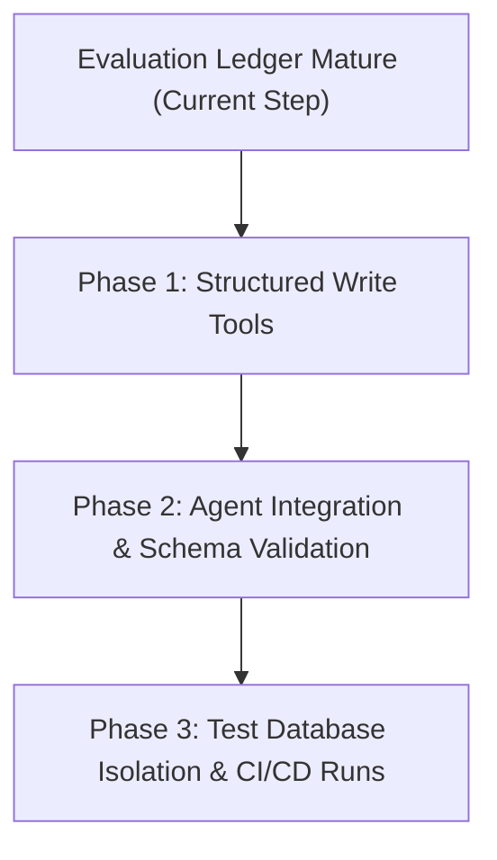
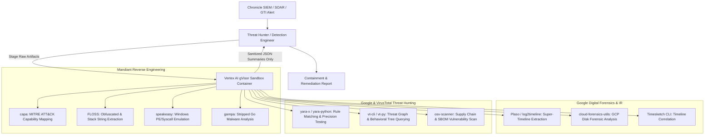

# Future Work: Dynamic Knowledge Graph Memory

This document outlines the vision, architectural considerations, and implementation plan for evolving the Security Operations Knowledge Graph from a static reference dataset into a **dynamic, living memory graph**.

> [!IMPORTANT]
> To ensure system stability and scientific rigor, we are **holding off** on implementing dynamic writes to the knowledge graph until our **Evaluation Ledger & Regression Testing Framework** is fully mature and operational. Having a robust evaluation loop is a strict prerequisite to safely measuring the impact of stateful database writes.

---

## 1. The Vision: Dynamic Memory Synthesis

Currently, the Neo4j knowledge graph is a static historical snapshot of threat campaigns, populated offline from `knowledge_graph.json`.

In the next phase, the agent network will be equipped with **write access** to the graph database. As the Orchestrator triages incoming alerts, coordinates investigations, and learns new threat intelligence, it will programmatically write these findings back to the Neo4j database in real-time.

### Expected Capabilities:
* **Real-time Entity Enrichment:** When the Threat Hunter discovers a new IP address or file hash beaconing in the SIEM, it can dynamically create a new node and link it to the active investigation.
* **Incident Lifecycle Tracking:** The Tier 2 Responder can update relationship edges to reflect containment status (e.g., changing a host relationship from `COMPROMISED` to `ISOLATED`).
* **Cross-Incident Correlation:** If a newly investigated alert shares an indicator with a historical case, the Orchestrator can write a `RELATED_TO` edge, alerting analysts to a broader, persistent campaign.

---

## 2. Key Architectural Challenges

Evolving to a stateful, dynamic memory graph introduces several complex challenges:

### A. Write Safety & Cypher Injection Prevention
Allowing an LLM to generate and execute raw Cypher write queries (`CREATE`, `MERGE`, `SET`) is a major security risk. A malicious prompt injection could command the agent to delete the entire database:
```cypher
MATCH (n) DETACH DELETE n
```
* **Mitigation Strategy:** The agents will **never** write raw Cypher queries. Instead, we will design highly structured, abstract write tools (e.g., `add_entity_node()`, `link_entities()`, `update_edge_status()`) that use parameterized inputs and sanitize all strings. The underlying Python code will handle the Cypher execution safely.

### B. Graph Consistency & Schema Integrity
Without strict validation, different agents might write duplicate nodes, use inconsistent names (e.g., `wrk-shasek` vs. `WRK-SHASEK.domain.local`), or pollute the database with unstructured properties.
* **Mitigation Strategy:** We will implement a strict schema validation layer in the Python database utility. Every write tool will validate inputs against our defined SecOps ontology before executing the write transaction.

### C. Evaluation Determinism & Test Isolation
If the database state is constantly changing as tests run, evaluations will lose reproducibility. A query that passed yesterday might fail today because a previous run left dirty state in the database.
* **Mitigation Strategy:** We must establish **test database isolation**. When running evaluations, the runner will:
  1. Point the agent to a dedicated, isolated test database instance.
  2. Clear the database state and re-seed it with the baseline `knowledge_graph.json` before running the test suite.
  3. Prevent any dynamic writes from leaking into the production database.

---

## 3. Phased Implementation Roadmap

Once the evaluation harness is fully validated, we will proceed in three phases:



* **Phase 1: Structured Write Tools:** Develop the parameterized Python helper functions for Neo4j CRUD operations, ensuring zero raw Cypher generation by the LLM.
* **Phase 2: Agent Integration:** Equip the Orchestrator and Threat Hunter with the new tools, updating their system instructions to explain *when* and *how* to log new findings to the graph.
* **Phase 3: Test Isolation & Regression Runs:** Integrate the isolated Neo4j re-seeding script into `manage_eval.py`, running regression tests to verify that dynamic writes improve overall threat correlation without introducing hallucinations.

---

---

## 5. Sandboxed Infosec CLI Tooling (Google & Mandiant Suite)

Running untrusted, weaponized security artifacts directly inside the agent host environment poses severe parser-exploit and breakout risks. In future phases, our **Vertex AI Code Execution Sandbox (gVisor microVMs)** will serve as an isolated detonation and deep-inspection environment equipped with first-party Google and Mandiant infosec CLI tools:



### Tooling Categories & Capabilities:
1. **Mandiant FLARE Suite (Reverse Engineering & Binary Triage):**
   - **`capa`:** Automated malware capability detection mapping binary logic directly to MITRE ATT&CK techniques without manual disassembly.
   - **`FLOSS`:** Automated string solver extracting encrypted, stack-allocated, and XOR-obfuscated strings from malware.
   - **`speakeasy`:** Portable x86/x64 Windows binary and shellcode emulator executing hostile code in a software CPU engine to log API calls, registry modifications, and network connections.
   - **`gampa`:** Reconstructing stripped Golang binary symbols, type descriptors, and call graphs.
2. **Google DFIR (Forensics & Timeline Reconstruction):**
   - **`Plaso` (`log2timeline`):** Ingests raw disk images, NTFS `$MFT`, Windows EVTX, and syslogs to generate microsecond-accurate super-timelines.
   - **`cloud-forensics-utils` / `libcloudforensics`:** Automates forensic snapshotting, disk analysis, and memory capture on GCP Compute Engine VMs.
   - **`Timesketch` CLI:** Programmatically query, correlate, and sketch events across compromised endpoints.
3. **Google Threat Hunting & Signature Engineering:**
   - **`yara` / `yara-x`:** Evaluates detection rules against memory dumps, PCAPs, and binaries in an isolated sandbox.
   - **`vt-cli` / `vt-py`:** Programmatic VirusTotal threat graph queries and sandbox behavioral extraction.
   - **`osv-scanner`:** Vulnerability scanning of open-source dependencies and container lockfiles.
4. **Network & Packet Forensics:**
   - **`zeek` & `scapy`:** Structured protocol logging (`conn.log`, `dns.log`, `http.log`) and programmatic packet manipulation on PCAP dumps.

### Hardened Sandbox Guardrails:
- **Default-Deny Egress (`network_enabled=False`):** Prevents emulated malware from phoning home to live C2 nodes or probing corporate networks.
- **Read-Only Input Mounts:** Untrusted disk images, PCAPs, and binaries are mounted read-only.
- **MicroVM & Kernel Isolation:** gVisor intercepts and isolates all guest Linux syscalls from host kernel memory.

