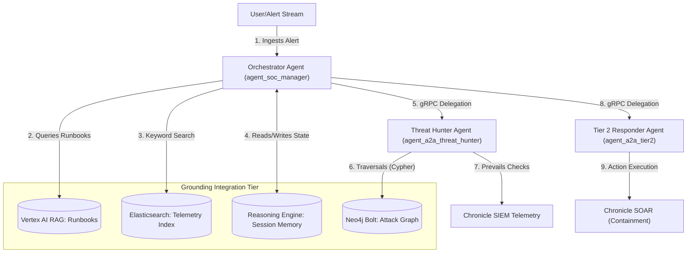

# SecOps AI Multi-Agent Grounding Architecture

This document maps out the **multi-tiered grounding architecture** powering the Coordinated Agent-to-Agent (A2A) Network. To achieve high-fidelity security reasoning, rapid response, and absolute factual correctness, the agents are grounded in four distinct data structures representing runbook knowledge, historical security cases, relational threat graphs, and session memories.

---

## 1. Grounding Architecture Schematic

Below is the state-of-the-art visual blueprint of our multi-agent grounding ecosystem, mapping ingestion sources, processing VM pipelines, and the gRPC connection interfaces for our five remote specialists.

---

## 2. Component Directory & Data Flows

The grounding system is categorized into four tiers, each serving a specific cognitive function for the remote specialist agents:

| Grounding Component | Primary Ingestion Source | Management Script | Primary Consumer | Use Case / Cognitive Value |
| :--- | :--- | :--- | :--- | :--- |
| **Vertex AI RAG** | `external/adk_runbooks/` & `external/ai-runbooks/` | [manage_rag.py](file:///Users/dandye/Projects/agentic_soc_agentspace__worktrees/harvest_detection_reports/installation_scripts/manage_rag.py) | **Orchestrator** & **CTI Researcher** | Pulls structured, static security procedures, compliance guidelines, and incident response playbooks (IRPs). |
| **Elasticsearch VM** | Harvested telemetry, case files, and playbooks | [manage_elasticsearch.py](file:///Users/dandye/Projects/agentic_soc_agentspace__worktrees/harvest_detection_reports/installation_scripts/manage_elasticsearch.py) | **Orchestrator** | Enables sub-millisecond keyword indexing and dense vector search across historical incident reports. |
| **Neo4j Graph DB** | `harvested_investigations/knowledge_graph.json` | [manage_neo4j.py](file:///Users/dandye/Projects/agentic_soc_agentspace__worktrees/harvest_detection_reports/installation_scripts/manage_neo4j.py) | **Threat Hunter** | Traverses relationships between compromised entities (e.g., matching a lateral logon path from host to Domain Controller). |
| **Reasoning Engine Memory** | Vertex AI session context | [manage_agent_engine.py](file:///Users/dandye/Projects/agentic_soc_agentspace__worktrees/harvest_detection_reports/installation_scripts/manage_agent_engine.py) | **All Agents** | Retains multi-turn conversation states, intermediate tool thoughts, and system prompts within a session. |

---

## 3. Grounding Integration Flow

The following Mermaid diagram traces the dynamic integration of these components during a security investigation. When the user submits an alert, the Orchestrator triages the threat, pulls grounding context, and delegates execution.

---

## 4. Synchronization & Update Frequency Spectrum

To maintain high-fidelity operations, the grounding sources are updated at different intervals matching their core cognitive function:

1.  **Session Memory (Instantaneous / Per-Turn):**
    *   *Interval:* Sub-second, continuous.
    *   *Cognitive Value:* Retains active dialog turns, tool call arguments, and thoughts for the current in-process execution. Discarded or archived upon session teardown.
2.  **Neo4j Graph Database (Near Real-time / Event-Driven):**
    *   *Interval:* Dynamic, triggered on alert ingestion or telemetry harvesting.
    *   *Cognitive Value:* Maps and updates entity-relationship linkages as soon as a new security alert or telemetry file is ingested.
3.  **Elasticsearch (On-Demand / Scheduled Sync):**
    *   *Interval:* Daily or scheduled.
    *   *Cognitive Value:* Indexes new threat reports, past case summaries, and raw UDM logs to ensure fast search retrieval.
4.  **Vertex AI RAG (Static / Release-Driven):**
    *   *Interval:* Infrequent, triggered only by git commits or major playbooks releases.
    *   *Cognitive Value:* Houses official corporate Incident Response Plans (IRPs), compliance checklists, and static operating guidelines that require formal authorization before modification.

---

## 5. Ingestion & Synchronization Pipelines

To ensure that grounding databases never become stale, the platform implements unified CLI pipelines for continuous synchronization:

### A. Runbooks to Vertex AI RAG
Local markdown runbooks are validated against structural standards, uploaded to a secure Google Cloud Storage bucket, and imported into the active RAG corpus:
*   **Just Shortcut:** `just sync-runbooks`
*   **Python Command:** `python manage.py rag sync-runbooks`
*   **Pipeline Logic:** Runs [manage_rag.py](file:///Users/dandye/Projects/agentic_soc_agentspace__worktrees/harvest_detection_reports/installation_scripts/manage_rag.py) to parse and upload only valid schemas, pruning orphaned records.

### B. Investigations to Neo4j Graph
Chronicle SIEM telemetry and case files are harvested locally and compiled into a high-density nodes-and-edges schema, then pushed directly to the GCE Neo4j graph:
*   **Just Shortcut:** `just neo4j-ingest`
*   **Python Command:** `python manage.py neo4j ingest`
*   **Pipeline Logic:** Runs [manage_neo4j.py](file:///Users/dandye/Projects/agentic_soc_agentspace__worktrees/harvest_detection_reports/installation_scripts/manage_neo4j.py) to ingest hosts, users, file hashes, and active network connections.

### C. Case Telemetry to Elasticsearch
Enables sub-millisecond grounding index queries bypassing heavy RAG pipelines when direct VM search is required:
*   **Just Shortcut:** `just elastic-sync recreate="true"`
*   **Python Command:** `python manage.py elastic sync`
*   **Pipeline Logic:** Runs [manage_elasticsearch.py](file:///Users/dandye/Projects/agentic_soc_agentspace__worktrees/harvest_detection_reports/installation_scripts/manage_elasticsearch.py) to rebuild and load playbooks.
