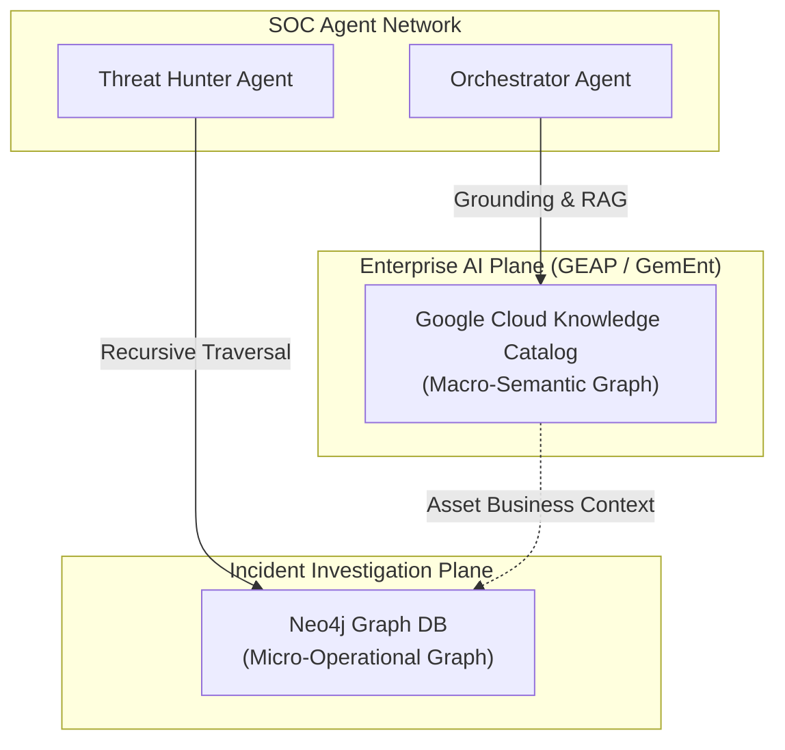

---
provenance:
  source_type: "generative_ai"
  source_tool: "Antigravity"
  timestamp: "2026-06-16T20:16:35Z"
---
# Architectural Brief: Google Cloud Knowledge Catalog vs. Neo4j in SecOps Multi-Agent Systems

This document outlines the architectural relationship, functional comparison, and coexistence strategy for Google Cloud's **Knowledge Catalog** and **Neo4j** within our Multi-Agent Security Operations (SOC) network.

---

## 1. Executive Summary

As enterprise AI agents evolve, grounding them in business semantics and real-world domain data is critical. Google Cloud's **Knowledge Catalog** (the AI-powered successor to Dataplex Catalog) serves as the native semantic grounding plane for the Gemini Enterprise Agent Platform (GEAP), natively ingesting Open Knowledge Format (OKF) bundles.

However, specialized graph databases like **Neo4j** remain essential for low-level, high-performance operational relationship analysis (e.g., active threat correlation). Rather than choosing one over the other, our architecture adopts a **Dual-Graph Coexistence Model**:
1. **Knowledge Catalog (Semantic Plane):** Grounding, runbook search, and historical case indexing.
2. **Neo4j (Operational Plane):** Live lateral movement tracing, process-tree mapping, and transient event correlation.

---

## 2. Structural Coexistence Model

---

## 3. Detailed Technical Comparison

| Dimension | Google Cloud Knowledge Catalog | Neo4j Graph Database |
| :--- | :--- | :--- |
| **Primary Role** | **Enterprise Semantic & Asset Plane** | **Operational Security Relationship Plane** |
| **Graph Type** | Asset-to-Concept Taxonomy (Metadata Graph) | Entity-to-Telemetry Relationship (Ontology Graph) |
| **What it Maps** | Business terms, runbooks, schemas, BigQuery tables, Cloud Storage buckets, and user access policies. | Transient security events: file hashes, IP beacons, parent-child processes, alerts, and cases. |
| **Query Strengths** | Natural language discovery, semantic search, policy compliance, and RAG grounding. | Recursive arbitrary-path traversals (e.g., *Find all hops between Compromised User X and Active Alert Y*). |
| **Native Integration** | Deeply and natively integrated with Gemini Enterprise (GemEnt) and GEAP. | Custom integration via agent tooling (Python Cypher client). |
| **Data Lifespan** | Long-term corporate knowledge, asset definitions, and organizational semantics. | High-velocity, transient incident telemetry and active threat campaign IOCs. |

---

## 4. Integration with Gemini Enterprise & GEAP

Knowledge Catalog is the native grounding engine for the Gemini Enterprise web UI and the Gemini Enterprise Agent Platform (GEAP).

### A. Grounding on Unstructured Runbooks
Instead of maintaining a custom vector database and search middleware (e.g., Elasticsearch or custom vector pipelines) for security playbooks, we can publish all runbooks as OKF bundles directly to the Knowledge Catalog. GEAP applications can then natively ground themselves in this catalog, allowing agents to retrieve and reason over playbooks using natural language with zero search code.

### B. OKF Native Ingestion
Because the Knowledge Catalog natively understands the Open Knowledge Format (OKF), the markdown reports and alerts we harvest from Chronicle and SOAR can be directly ingested as OKF bundles. This makes historical case files instantly browseable, searchable, and indexable by any enterprise-level Gemini agent.

---

## 5. Architectural Recommendations

To achieve maximum efficiency, security, and performance, our system adopts the following split:

### A. Deploy Knowledge Catalog for:
* **Playbooks and Incident Response Plans (IRPs):** Completely replaces custom vector search and RAG middleware.
* **Organizational Semantics:** Mapping asset ownership (e.g., which BigQuery table belongs to which security tier) and risk ratings.
* **Historical Reference Corpus:** Serving as the long-term searchable archive for all finalized SOC investigation reports.

### B. Maintain Neo4j for:
* **Active Incident Link-Analysis:** Running low-latency recursive Cypher queries to trace process parents, network hops, and lateral movement paths.
* **Stateful Incident Graphing:** Storing the active, transient relationships of a live investigation (e.g., linking active alert nodes to affected machine nodes).
* **CTI Pivoting:** Querying complex threat actor campaign ontologies during active triage.
