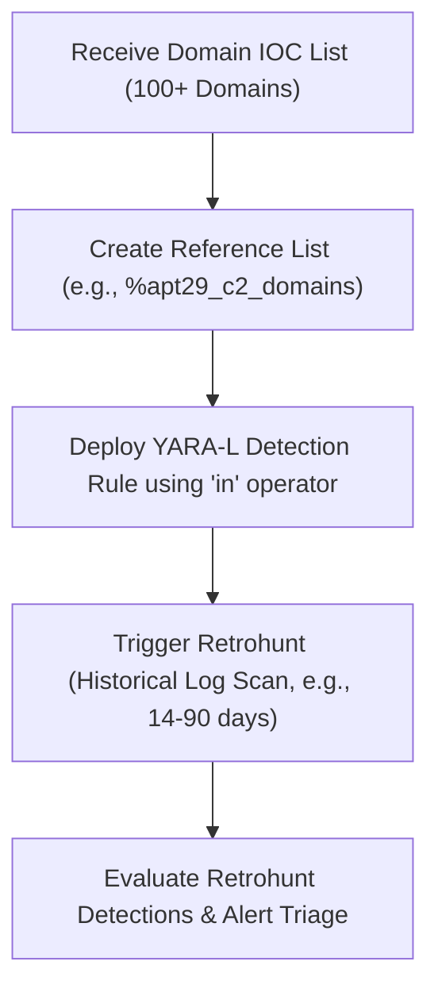

# SecOps Threat Hunting: Bulk Domain Hunting via Reference Lists & Retrohunt

> [!NOTE]
> This document establishes the standard operational procedure for hunting large lists of domain names or network indicators (100+ IOCs) in Google SecOps. Executing individual queries or massive `OR` chains for large sets is highly inefficient, hits query complexity limits, and degrades search performance.

---

## 1. Architectural Overview: Why Use Reference Lists?

When threat intelligence feeds deliver a large batch of domains associated with an active threat actor (e.g., APT29, Ransomware C2s), security analysts must scan historical logs to identify if internal assets have communicated with them.

In Google SecOps, executing a standard search like:
```udm
(target.hostname = "malicious1.com" OR target.hostname = "malicious2.com" OR ... OR target.hostname = "malicious200.com")
```
presents three severe problems:
1.  **Complexity Limits:** Large queries can easily exceed maximum token and AST depth limits in the SIEM.
2.  **Performance Degradation:** Sequential evaluation of hundreds of string comparison clauses forces the search engine to perform exhaustive scans, resulting in long timeouts.
3.  **High Maintenance:** Adding or removing domains requires rewriting, re-validating, and redeploying the search query or rule.

### The Best-Practice Solution:
1.  **Reference List (Data Table):** Store all target domains in a centralized, managed list resource (e.g., `%apt29_domains`).
2.  **YARA-L Rule:** Create a single detection rule that references the list using the YARA-L `in` operator.
3.  **Retrohunt:** Run a historical retrohunt job using the rule across the desired time window (up to 90 days of historical logs).

---

## 2. Step-by-Step Hunting Workflow



### Step 1: Create the Reference List

Reference lists are named collections of strings that can be referenced directly within YARA-L rules.

#### Procedure:
Create a new reference list named `apt29_c2_domains` containing the target list of domains. Each domain must be placed on a new line or added via the API.

*   **List Name:** `apt29_c2_domains`
*   **Description:** "High-priority C2 domain indicators associated with active APT29 espionage campaigns (June 2026)."
*   **Content Example:**
    ```text
    dom-news.com
    3aimsolutions.com
    7coo.com
    agencijazaregistraciju.rs
    amazonchocolate.com
    ```

> [!TIP]
> Always sanitize the domains (remove protocol prefixes `http://` or paths `/index.html`) before adding them to the list, as the YARA-L match evaluates exact hostname strings.

---

### Step 2: Create and Deploy the YARA-L Rule

Write a YARA-L rule that monitors all telemetry sources representing outbound web, proxy, and DNS traffic.

#### Production-Ready YARA-L Template:
```yara
rule bulk_domain_hunt_apt29 {
  meta:
    author = "Agentic SOC Team"
    description = "Detects outbound network communication or DNS resolution targeting known APT29 C2 domains."
    severity = "CRITICAL"
    mitre_attack_tactic = "TA0011" // Command and Control
    mitre_attack_technique = "T1071.001" // Application Layer Protocol: Web Protocols

  events:
    // Capture network connections, HTTP/S proxy traffic, or DNS resolutions
    $event.metadata.event_type = "NETWORK_CONNECTION" or
    $event.metadata.event_type = "DNS_QUERY"

    // Match the target hostname or query domain against our Reference List
    (
      $event.target.hostname in %apt29_c2_domains or
      $event.network.dns.questions.name in %apt29_c2_domains
    )

    // Track the internal asset initiating the connection
    $event.principal.asset.hostname = $asset_hostname

  match:
    $asset_hostname over 5m

  condition:
    $event
}
```

#### Key Elements Explained:
*   `in %apt29_c2_domains`: The `in` operator maps the event's target hostname or DNS question directly to the reference list. This is highly optimized under the hood, utilizing hash-table lookups rather than sequential scans.
*   `match:` block: Groups detections by the compromised internal asset (`$asset_hostname`) over a 5-minute window to consolidate alerts.

---

### Step 3: Run the Retrohunt

Once the rule is saved and validated, initiate a **Retrohunt** to scan historical log databases for matches.

#### Procedure:
1.  Navigate to the deployed rule in Google SecOps.
2.  Select **Run Retrohunt** (or trigger via API/CLI).
3.  Define the parameters:
    *   **Time Window:** Typically **14 to 30 days** (depending on the intelligence lifecycle; up to 90 days for deep investigations).
    *   **Scope:** All log sources.
4.  Execute the job. Google SecOps will scan all cold/warm historical telemetry in parallel and write any matches to the Rule Detections ledger.

---

## 3. Tool Mapping for Autonomous AI Agents

For **Orchestrator** and **Threat Hunter** agents operating via MCP, the following tools MUST be used to automate this workflow:

### 1. Creating/Managing the Reference List:
*   Use `create_reference_list` to provision the list resource in the cloud:
    *   `name`: `"apt29_c2_domains"`
    *   `description`: `"APT29 C2 domains for bulk hunt"`
    *   `lines`: `["dom-news.com", "3aimsolutions.com", ...]`
*   Use `update_reference_list` to append or remove domains as threat intelligence feeds update.
*   Use `get_reference_list` to verify the list contents before creating a rule.

### 2. Rule Creation and Validation:
*   Use `create_rule` to deploy the YARA-L rule. The rule content must contain the exact reference list name prefixed with `%` (e.g., `%apt29_c2_domains`).
*   Use `validate_rule` to ensure there are no syntax or compilation errors before running a retrohunt.

### 3. Executing Retrohunts & Fetching Results:
*   Use `evaluate_rule_coverage` or `list_rule_detections` to check for historical detections matching the rule.
*   If detections are found, use `get_alert_latest_investigation` or `trigger_investigation` to initiate an automated triage of the compromised endpoints.

---

## 4. Best Practices & Safety Guidelines

*   **Wildcard Hostnames:** Reference lists do not support regex wildcards automatically unless specified. For subdomain matching, ensure the rule handles it, or include both base domains and subdomains in the list.
*   **Performance Safety:** Never reference more than 5 distinct reference lists in a single YARA-L rule to avoid hitting compilation limits.
*   **Periodic Cleanup:** Set an expiration or scheduling policy to delete or archive reference lists that have not matched any logs in over 90 days to prevent workspace clutter.
