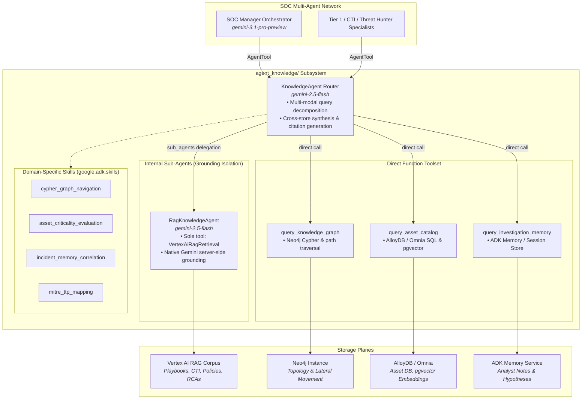

# KnowledgeAgent Subsystem: Multi-Modal Enterprise Knowledge Grounding Design

## 1. Overview & Objectives

Design and integrate the **`KnowledgeAgent` Subsystem** for the **Agentic SOC** platform. The `KnowledgeAgent` serves as an intelligent, multi-modal knowledge aggregator and router that unifies four distinct knowledge planes:
1. **Unstructured RAG & Knowledge Engine** (`VertexAiRagRetrieval` over Vertex AI RAG Corpora): Incident response playbooks (IRPs), security & compliance policies, CTI threat actor dossiers, and historical incident retrospectives.
2. **Operational Relationship Graph** (Neo4j): Multi-hop entity topology, user-machine-process graphs, lateral movement path tracing, and attack blast-radius calculation.
3. **Hybrid Relational & Vector Catalog** (AlloyDB / Omnia with 768-dim `pgvector`): Asset inventories, criticality tiers (Tier 0 Domain Controllers, Crown Jewels), and semantic case histories.
4. **Agent Working & Long-Term Memory** (ADK Memory Bank & Session State): Cross-session analyst notes, entity observation tags, and ongoing investigation hypotheses.

The subsystem is exposed to the primary **SOC Manager Orchestrator** (`agent_soc_manager`) and specialist agents (e.g., `agent_a2a_cti_researcher`) via a single, clean `AgentTool` interface.

---

## 2. Architectural Design



---

## 3. Component Specifications

### 3.1 Module Layout (`agent_knowledge/`)
Following the project's explicit architectural pattern of self-contained modules with intentional encapsulation:

```
agent_knowledge/
├── __init__.py                      # Module exports (knowledge_agent, knowledge_agent_tool)
├── agent.py                         # KnowledgeAgent router & orchestration definition
├── sub_agents/
│   ├── __init__.py
│   └── rag_agent.py                 # Isolated RagKnowledgeAgent with VertexAiRagRetrieval
├── tools/
│   ├── __init__.py
│   ├── graph_tool.py                # Neo4j Cypher query & relationship traversal functions
│   ├── alloydb_tool.py              # AlloyDB SQL queries & 768-dim pgvector similarity search
│   └── memory_tool.py               # ADK Memory bank query and context loader functions
└── skills/
    ├── cypher_graph_navigation/
    │   ├── SKILL.md                 # Safe Cypher heuristics, recursive hop limits, attack templates
    │   └── references/queries.md    # Pre-canned patterns for lateral movement, credential theft
    ├── asset_criticality_evaluation/
    │   ├── SKILL.md                 # Asset tiers (Tier 0 DCs, Crown Jewels), data classification
    │   └── references/schemas.md    # AlloyDB table structures, vector similarity thresholds
    ├── incident_memory_correlation/
    │   ├── SKILL.md                 # Heuristics for matching ongoing incidents to past investigations
    │   └── references/taxonomy.md   # Entity tagging conventions & retrospective structures
    └── mitre_ttp_mapping/
        ├── SKILL.md                 # Mapping threat behaviors across graph nodes and RAG docs
        └── references/att&ck.md     # MITRE ATT&CK Enterprise matrix cross-references
```

### 3.2 Modality & Tool Interface Contracts

#### A. Unstructured RAG Plane (`sub_agents/rag_agent.py`)
- **Model**: `gemini-2.5-flash`
- **Tool**: `VertexAiRagRetrieval(name="retrieve_enterprise_docs", rag_corpora=[os.environ.get("RAG_CORPUS_ID")])`
- **Behavior**: Uses Gemini 2.0+ native server-side `retrieval.vertex_rag_store` grounding to retrieve and synthesize incident response playbooks, compliance guidelines, CTI actor dossiers, and historical incident retrospectives with source citations.

#### B. Operational Graph Plane (`tools/graph_tool.py`)
- **Function**: `async def query_knowledge_graph(query_type: str, entity_value: str, custom_cypher: Optional[str] = None, max_hops: int = 3, ctx: Optional[Context] = None) -> str`
- **Supported Query Types**:
  - `entity_neighborhood`: Immediate 1-hop connections (logged-on users, child processes, open ports).
  - `lateral_movement_path`: Shortest and multi-path traversals between compromised source node and destination host/DC.
  - `credential_blast_radius`: Enumerate all machines and services accessible by compromised identities.
  - `raw_cypher`: Parameterized read-only Cypher query with timeout (5s) and hop guards.

#### C. Hybrid Relational & Vector Catalog Plane (`tools/alloydb_tool.py`)
- **Function**: `async def query_asset_catalog(query: str, search_mode: str = "hybrid", asset_tier_filter: Optional[str] = None, top_k: int = 5, ctx: Optional[Context] = None) -> str`
- **Search Modes**:
  - `exact_asset`: SQL lookup for machine hostname, MAC, IP, OS version, owner, and business unit.
  - `semantic_case_history`: 768-dim `pgvector` similarity search over historical incident resolution logs and asset risk notes.
  - `hybrid`: Combined metadata filtering with vector similarity ranking.

#### D. Cross-Session Memory Plane (`tools/memory_tool.py`)
- **Function**: `async def query_investigation_memory(entity: Optional[str] = None, query: Optional[str] = None, max_results: int = 5, ctx: Optional[Context] = None) -> str`
- **Behavior**: Retrieves active analyst notes, ongoing investigation hypotheses, past containment tags, and entity alerts across conversation sessions via ADK's Memory Service.

---

## 4. Orchestrator Integration & AgentTool Packaging

In `agent_knowledge/__init__.py`:

```python
from google.adk.tools.agent_tool import AgentTool
from .agent import knowledge_agent

knowledge_agent_tool = AgentTool(
    agent=knowledge_agent,
    name="query_enterprise_knowledge",
    description=(
        "Query the unified multi-modal SOC knowledge base spanning: "
        "1) Unstructured RAG (IRP runbooks, CTI threat dossiers, compliance policies, retrospectives), "
        "2) Neo4j Operational Graph (lateral movement, user-machine-process topologies), "
        "3) AlloyDB/Omnia (asset criticality catalogs and pgvector semantic case histories), "
        "4) Working Memory (analyst notes, active investigation hypotheses, entity tags)."
    ),
)
```

In `agent_soc_manager/agent.py`:
- Replace legacy one-off RAG function tools with `knowledge_agent_tool` in the root orchestrator's `tools` list.

---

## 5. Resilience & Fault Tolerance Strategy

1. **Graceful Store Degradation**: If a specific backend database (e.g., Neo4j or AlloyDB) is temporarily unreachable or unconfigured (missing environment variables), its tool returns a structured fallback message (`"[Neo4j Unavailable: Query skipped]"`). The `KnowledgeAgent` synthesizes findings from available stores without failing the user turn.
2. **Query Safety Bounds**: Cypher queries enforce read-only transactions, max hop limits (`max_hops <= 4`), and a 5-second timeout.
3. **Citation Preservation**: Grounding citations from `RagKnowledgeAgent` are preserved in the synthesized response to ensure transparency for SOC analysts.

---

## 6. Evaluation & Verification Strategy

### 6.1 Unit & Integration Tests (`tests/test_knowledge_agent.py`)
- Test individual tools (`graph_tool`, `alloydb_tool`, `memory_tool`) with mock and live connections.
- Verify sub-agent instantiation and single-tool constraint isolation for `RagKnowledgeAgent`.
- Test graceful error handling when individual database connections are simulated as down.

### 6.2 ADK Automated Evaluator Benchmark (`test_agents/soc_knowledge_agent/`)
- Create `test_agents/soc_knowledge_agent/` with `evalsets/soc_knowledge_evalset.json` covering:
  1. Pure RAG query (Ransomware containment playbook).
  2. Pure Graph query (Lateral movement path from workstation to Domain Controller).
  3. Pure Asset query (Criticality rating for crown-jewel database).
  4. Composite query (Entity lateral movement + Asset tier + Remediation playbook + Memory notes).
- Execute automated evaluation using `AgentEvaluator.evaluate_eval_set()` in `test_adk_evals.py` verifying criteria:
  - `tool_trajectory_avg_score`
  - `rubric_based_final_response_quality_v1`
  - `rubric_based_tool_use_quality_v1`
